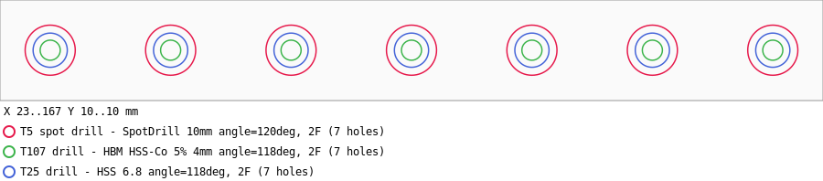

# GSeam: CNC G-code Post-Processing Tools

Python tools to merge, clean and validate CAM G-code (Fusion 360, FreeCAD,
...) **before sending jobs to LinuxCNC**, plus a Fusion 360 tool-library →
`tool.tbl` converter. Python 3, standard library only.

---

## gseam.py — merge, clean & validate

Merges multiple CAM-exported `.ngc` files into one program with a single
header/footer, or just validates files with `--check`.

```bash
# merge all .ngc files in a folder - "..._P1of4.ngc" style names are ordered
# by part number AND checked for completeness (a missing part aborts);
# otherwise files are sorted by their trailing number (op1, op2, ...)
python3 gseam.py operations/ merged.ngc

# explicit order
python3 gseam.py op1.ngc op2.ngc op3.ngc merged.ngc

# insert "O <toolchange> call" before each toolchange (no-REMAP setups)
python3 gseam.py --insert-toolchange-call operations/ merged.ngc

# validate only: units, work offsets, tool table, extents
python3 gseam.py --check op1.ngc op2.ngc
```

### Features

- **Order safety in directory mode** — `PxofN` names (P1of4 ... P4of4)
  are ordered by part number; the set must be complete and unmixed or the
  merge aborts, so spot-drill-before-drill order can't silently break.
  An explicit file list always wins.
- **Structure-based parsing** — operations are found via their toolchange
  line plus the comment block above it. One header, one footer, no
  duplicated setup lines, no duplicate N numbers, single `M30`/`%`.
- **Skips redundant toolchanges** — consecutive files using the same tool
  don't get a second `Tn M6` (no pointless tool-change stop mid-job).
  Disable with `--keep-duplicate-toolchanges`.
- **Safety checks** — `G20` (inch) input is a hard error unless
  `--allow-inch`; unit mismatch between files is an error; mixed work
  offsets (G54/G55/...) warn; missing `G90` warns.
- **Tool table check** — every `T` number used must exist in your
  `tool.tbl` (`--tool-table PATH`; auto-detected when the script lives in
  a `scripts/` folder next to one; `--no-tool-check` disables).
- **Extents report** — X/Y/Z min/max plus Zmin per tool (endpoint-based,
  `G53` moves excluded): a quick sanity check against your stock.
- Fusion "personal use" nag comments and vendor boilerplate are dropped;
  operation/tool comments are kept (`--keep-all-comments` keeps all).
- Renumbering with a single sequence (`--step`, `--no-renumber`); O-word
  lines are never numbered.
- **Spot-coverage check** — with both spot-drill and drill operations
  (classified via the tool.tbl descriptions), every drilled XY must have
  been spot-drilled first: warning, or error under `--secure`.
- **`--secure`** — reads machine limits from a LinuxCNC `.ini` and the
  current G54 offset + rotation from `linuxcnc.var` (`--ini`/`--var`,
  auto-detected next to the tool table) and fails if the program would
  leave the machine envelope.
- **Job card** — the merged file starts with `(JOB:)`/`(OP:)` comments:
  per tool description, hole count, Zmin and a rough time estimate.
- **`--preview`** — top-down SVG next to the output (`--preview-file PATH`):
  holes at true tool diameter, one colour per tool, feed paths, legend.
  A real example (7×M8 thread prep: spot → Ø4 pilot → Ø6.8 tap drill):

  
- **`--archive-parts DIR`** — after a successful merge, move the input part
  files into DIR (relative to the output's folder): the working folder keeps
  only ready-to-run programs. Never runs on `--check`/`--dry-run`/errors.
- Non-zero exit code on validation errors — safe for shell pipelines.
- `--dry-run` shows the plan and report without writing.

### LinuxCNC toolchange integration

Two ways to get a safe toolchange position:

1. **REMAP (recommended):** add to your INI and keep plain `Tn M6` in the
   G-code — no gseam option needed:

   ```ini
   [RS274NGC]
   REMAP=M6 modalgroup=6 ngc=toolchange
   ```

2. **Explicit subroutine call:** run gseam with
   `--insert-toolchange-call` to insert `O <toolchange> call` before every
   toolchange, and provide a `toolchange.ngc` in your subroutine path.
   Minimal version:

   ```gcode
   O<toolchange> sub
   G53 G0 Z0
   G53 G0 X0 Y0
   M0 (Change tool and press cycle start)
   O<toolchange> endsub
   M2
   ```

   Never combine both: with `REMAP=M6` active, an inserted
   `O <toolchange> call` would run the routine **twice** per change.

### Multi-tool programs and tool length — read this

Merging single-tool files into one program has a hidden trap: with manual
collets the stickout is not repeatable, and **mid-program (during the M0
pause) there is no MDI/touch-off available** in LinuxCNC. If your tool
table has `Z 0.000` everywhere, the second tool runs with the first tool's
work Z — too deep or in the air.

Solutions, simplest first:

* keep all tools at an identical, mechanically-repeatable stickout, or
* measure real tool lengths into the tool table (`G10 L1`), or
* **measure at every toolchange** on a fixed tool-length sensor. See
  `Example/routines/toolchange.ngc` for a complete comparative routine:
  it probes the *current* tool, pauses for the swap, probes the *new*
  tool and shifts the work-Z by the difference — no absolute calibration
  needed, collet stickout becomes irrelevant. The sensor position lives in
  the INI in **machine coordinates** (`G53`, independent of work zero and
  rotation):

  ```ini
  [TOOLSENSOR]
  X = 0
  Y = 0
  PROBE_START_Z = -400
  MAX_DEPTH = 60
  FAST_F = 300
  SLOW_F = 25
  ```

  Wire the sensor into `motion.probe-input` (OR it with your existing
  probe channels) so `G38.x` sees it.

---

## f360_toollib_convert.py — Fusion 360 library → tool.tbl

```bash
# sync tool.tbl from a fresh Fusion export — keeps measured Z offsets!
python3 f360_toollib_convert.py Library.json -o tool.tbl

# see what would change first
python3 f360_toollib_convert.py Library.json -o tool.tbl --dry-run
```

### Features

- **Preserves measured Z length offsets** on re-sync (default
  `--z-source preserve`): re-exporting your library no longer wipes tool
  lengths you measured. New tools get `Z+0.000`. Other sources:
  `--z-source zero`, `--z-source assembly` (gauge length), `--z-value N`.
- **Diff before writing** — added / removed / changed tools are listed.
- **Backup** — the previous table is saved as `tool.tbl.bak`.
- Warnings for duplicate tool numbers and pocket collisions.
- Pocket mapping: `--pocket-offset N`, `--pocket-fixed N`,
  `--pocket-map "T1:5,T2:3"`.
- Output tokens are LinuxCNC-parser-safe (`T40`, never `T 40`); old tables
  with spaced tokens are still read correctly.

After writing, reload the tool table in LinuxCNC (or restart).

---

## Tests

```bash
python3 -m unittest discover tests        # -v for verbose
```

Self-contained tests (stdlib `unittest`, synthetic fixtures — no
example files or machine needed).

---

## Contributions

PRs and suggestions are very welcome! Please add clear test cases/examples
if you propose new features.

## License

GSeam is free software: you may use, modify, and share it, **provided that
any changes or improvements are contributed back to this project
(copyleft)**.

- Commercial and non-commercial use allowed
- Modification allowed, but you **must** submit your improvements via pull
  request or equivalent for the benefit of all users
